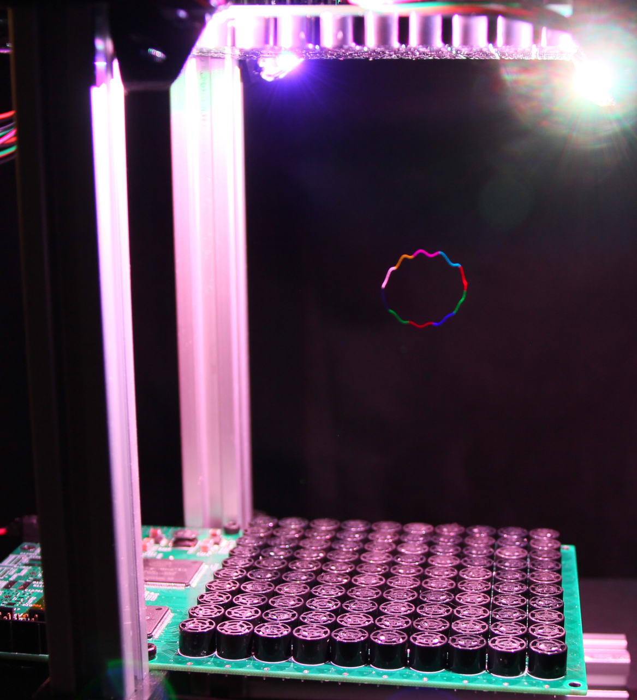

# VDATP
## Volumetric Display using an Acoustically Trapped Particle

This was such a fun project - I still giggle (maniacally) when watching this thing go.  There's something truly magical about watching something levitate in mid-air and then start zipping around so fast, you can't see it.  In any case, I hope these project files help someone!

References:
- PhysicsGirl acoustic levitator: https://www.youtube.com/watch?v=ABjRnSYw-4k
- Acoustic levitator Instructable: https://www.instructables.com/Acoustic-Levitator/
- University of Sussex video: https://www.youtube.com/watch?v=Tm8JRlJ1q50
- University of Sussex paper: http://sro.sussex.ac.uk/id/eprint/86930/